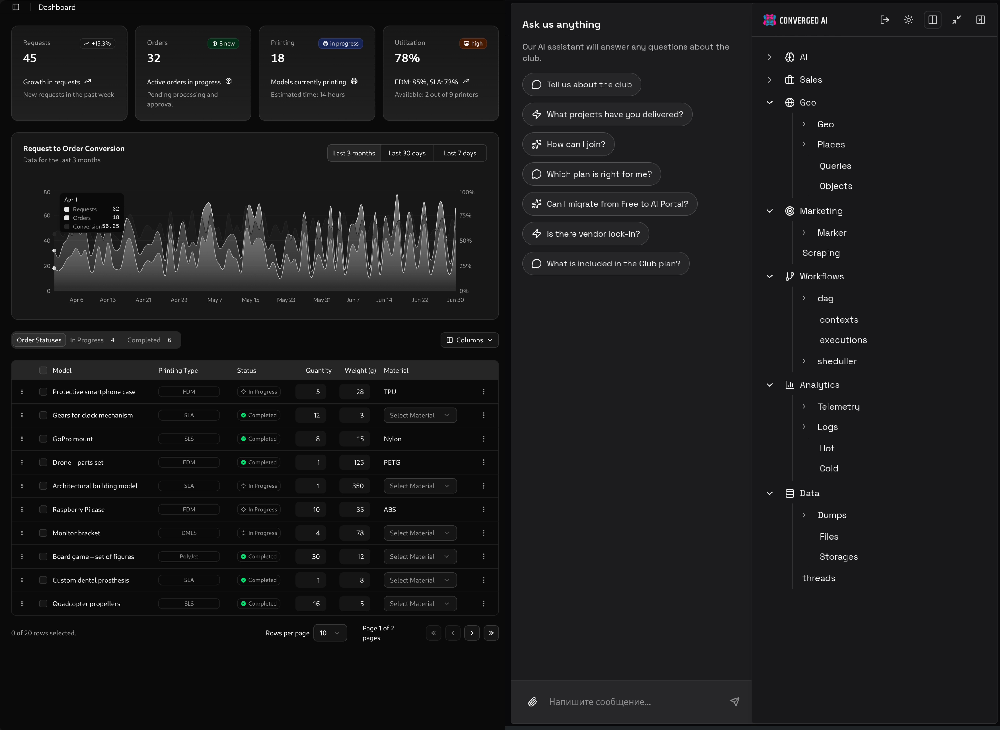

# Converged

A CNC shop or 3D print bureau has two kinds of work: making things, and everything around making things.

The second kind — incoming requests, client messages, order statuses, file handling, queue management, notifications, delivery tracking, payment events, "is it ready yet?" at 11pm — does not require a machinist. It requires a system. That is what Converged is.

Converged is the digital layer of a manufacturing business. Every task that can be handled by software is handled by Converged. The shop focuses on production.

In practice: a client submits a request through the website or the mobile app — it gets logged, routed, and the right person is notified. A new order enters the queue with deadlines tracked automatically. The team checks status, asks questions, or triggers actions through an AI chat built into the same interface. Nobody has to chase anything manually across separate tools.

On the equipment side, Converged reads telemetry from the machines — 3D printers (Bambu Lab, Marlin, Klipper), CNC machines, robotic arms — and uses it to manage work distribution: which job goes to which machine, what's idle, what's overloaded, what's at risk of missing a deadline. The machines themselves are operated by your team as always; Converged handles the scheduling and visibility layer on top. Think of OctoPrint or OctoFarm, but one level up: instead of a window into individual printers, you get a live picture of the whole floor tied into the order and client workflow.

Workflows are built on a DAG automation engine — order routing, escalations, queue balancing, multi-step chains. A dedicated Runtime layer (RT) handles all workflow execution and cron scheduling as a stateless service, keeping microservices as pure data stores. AI sits on top as the interaction layer: operators and clients communicate in natural language, the system figures out what to do. Multiple LLM providers run simultaneously (OpenAI, Anthropic, DeepSeek, Mistral, Gemini), each for its own tasks, within a unified permissions and audit model.

The platform is modular and open-source. The same building blocks configure into any profile: 3D printing service bureau, CNC job shop, R&D lab, distributed network of workshops.

Development track: [github.com/solenopsys/converged](https://github.com/solenopsys/converged)



---

## Architecture

### System overview

```
┌─────────────────────────────────────────────────────────────┐
│                        Operator / Client                    │
└───────────────────┬─────────────────────┬───────────────────┘
                    │ Browser              │ Messenger / API
                    ▼                      ▼
┌─────────────────────────────────────────────────────────────┐
│                     Frontend (SPA + Landing)                │
│   front-core  ┊  microfrontends (x20)  ┊  import map        │
└───────────────────────────┬─────────────────────────────────┘
                            │ HTTP
                            ▼
┌─────────────────────────────────────────────────────────────┐
│                    back-core (Elysia / Bun)                 │
│  /health   /services/<name>/<method>   static SPA fallback  │
│                                                             │
│  ┌──────────┐ ┌──────────┐ ┌──────────┐ ┌───────────────┐   │
│  │ security │ │ business │ │   social │ │  ai / agents  │   │
│  │ auth     │ │ billing  │ │ telegram │ │  assistant    │   │
│  │ access   │ │ dag      │ │ discord  │ │  LLM adapters │   │
│  │ oauth    │ │ requests │ │ notify   │ │  (GPT/Claude/ │   │
│  └──────────┘ │ scheduler│ └──────────┘ │  DeepSeek...) │   │
│               └──────────┘              └───────────────┘   │
│  ┌──────────┐ ┌──────────┐ ┌──────────┐ ┌───────────────┐   │
│  │ content  │ │   data   │ │ delivery │ │  analytics    │   │
│  │ markdown │ │ files    │ │ dhl/ups  │ │  logs         │   │
│  │ gallery  │ │ store    │ │ fedex    │ │  telemetry    │   │
│  │ struct   │ │ dumps    │ │ ems      │ │  usage        │   │
│  └──────────┘ └──────────┘ └──────────┘ └───────────────┘   │
└───────────────────────────┬─────────────────────────────────┘
                            │ FFI / Zig adapters
                            ▼
┌─────────────────────────────────────────────────────────────┐
│                    Hardware / Equipment                       │
│  Bambu Lab (MQTT)  ┊  Marlin/serial  ┊  Klipper/Moonraker   │
│  UVtools (resin)   ┊  CNC machines   ┊  Robotic arms         │
└─────────────────────────────────────────────────────────────┘
```

### Monorepo layout

```
converged-portal/
├── back/                  # Backend
│   ├── back-core/         # Elysia runtime + dynamic plugin loading
│   ├── microservices/     # 49 microservices organized by domain
│   └── runtime/           # Runtime layer (stateless workflow executor)
│       ├── engines/dag/   # Workflow base class, NodeProcessor
│       ├── engines/cron/  # Cron scheduling engine
│       └── workflows/     # Workflow definitions (package: converged-workflows)
├── front/                 # Frontend
│   ├── front-core/        # React core, components, state (Effector)
│   ├── spa/               # SPA plugin (Elysia)
│   ├── landing/           # SSR landing page
│   └── microfrontends/    # 20 independent UI modules
├── tools/
│   ├── integration/       # NRPC contracts and client codegen
│   ├── configurator/      # Containerfile/Helm/k3s artifact generator
│   └── cli/               # CLI utilities
└── native/                # Native Zig adapters (LMDB, printers, IoT)
```

### Backend: Plugin Runtime

The backend is built on [Elysia](https://elysiajs.com/) and runs on [Bun](https://bun.sh/) — the fastest and most lightweight JS runtime available today. Bun is written in Zig, runs 2–3× faster than Node.js, and consumes significantly less memory, making it ideal for edge deployment — the platform runs comfortably on single-board computers for $100. In development mode, `back-core` reads `config.json`, dynamically imports plugins for all active microservices, and mounts them into a single HTTP application.

In production, the runtime reads `runtime-map.toml` with the specific plugin list for a given container — the same code runs as a monolith or as a set of independent services.

Each microservice is an Elysia plugin with a factory function `createHttpBackend({ metadata, serviceImpl })`. Configuration is passed via `PluginConfig`: data path, AI keys, addresses of neighboring services.

### NRPC: Contract Layer

NRPC (Network RPC) is a thin layer over HTTP that binds contracts to implementations and generates typed clients.

Contracts are TypeScript interfaces in `tools/integration/types/*.ts`. The code generator produces `g-<service>` packages with metadata, types, and client factories.

**HTTP convention:**
- `POST /services/<serviceName>/<methodName>` — regular call
- `POST /services/<serviceName>/<methodName>/stream` — streaming (`AsyncIterable`)
- JWT HS256 for access control (modes: `optional` / `required` / `off`)

### Data Storage

Each service stores data under `$DATA_DIR/<msName>/` — no overlap between services. The unified `StoresController` abstraction supports multiple backends:

| Type | Technology | Use case |
|------|-----------|----------|
| SQL | SQLite + Kysely (WAL) | Relational data |
| KVS | LMDB (Zig binding) | Fast key-value |
| FILES | File system | Binary files, media |
| COLUMN | Column store | Metrics, time series |
| VECTOR | Vector store | Embeddings, semantic search |

### Frontend: Micro-frontends

`front-core` is the shared React core with components, state management, and routing. Each microfrontend is a separate ESM bundle loaded at runtime via import map. This allows updating UI modules without recompiling the entire frontend.

The SPA plugin serves:
- `/front-core.js` — core bundle
- `/vendor/*` — shared dependencies (React, libraries)
- `/mf/:name.js` — individual microfrontend bundle
- `/locales/*` — i18n resources

### LLM Agents

Models connect through adapters (GPT, Claude, DeepSeek, Mistral, Gemini). An agent receives context from telemetry and platform data, controls UI components, calls microservices, and triggers DAG processes.

All actions are logged and executed within the same access model (ABAC) as human users — each model has its own permission profile.

### Runtime Layer (RT)

The platform separates storage from execution. Each microservice owns its domain data and exposes a CRUD API — nothing more. All multi-step orchestration and integration logic lives in the Runtime layer.

**Microservices** are thin wrappers around a database. They handle storage, validation, and expose typed APIs to the UI and RT. `ms-dag` stores execution history and variables. `ms-sheduller` stores cron configurations.

**Runtime (RT)** is a stateless executor. It holds active cron jobs in memory, runs workflow logic, and writes results back to the relevant microservice stores via API. RT is compiled with all workflow definitions baked in — no dynamic loading.

```
UI → ms-dag        list executions, status, stats, vars (CRUD)
UI → ms-sheduller  create/update/delete crons (CRUD)
UI → RT            start workflow execution
RT → ms-dag        write execution records and node state
RT → ms-sheduller  read cron schedule on startup / refresh
```

When a cron config changes in `ms-sheduller`, the UI notifies RT to reload its in-memory schedule.

**Workflow definitions** are TypeScript classes compiled into the RT image at build time. They live in `back/runtime/workflows/` and import domain API clients (`g-dag`, `g-sheduller`, etc.) to interact with microservices.

The two runtime engines:
- `engines/dag` — `Workflow` base class and `NodeProcessor` for step tracking
- `engines/cron` — `CronEngine` for managing in-memory cron jobs via `croner`

---

## Deployment

The platform runs equally well on single-board computers (Orange Pi, 2 GB RAM) and in the cloud. The foundation is k3s — a lightweight Kubernetes distribution optimized for edge devices.

Three deployment profiles are available — same codebase, different container topology:

```
  mono                              multi
  ─────                             ─────

┌──────────┐            ┌──────────────┐  ┌─────────────┐
│  [UI]    │            │   [UI]       │  │   [RT]      │
├──────────┤            │  spa+landing │  │  workflows  │
│  [RT]    │            └──────┬───────┘  └──────┬──────┘
├──────────┤                   │                 │
│  [MS]    │       ┌───────────┼─────────────────┘
│all svc   │       │           │
├──────────┤       ▼           ▼            ▼
│ [storage]│  ┌────────┐ ┌─────────┐ ┌─────────┐
└──────────┘  │security│ │business │ │  data   │
              │  +ai   │ │+content │ │ +social │
              └────────┘ └─────────┘ └─────────┘

              ┌──────────────────────────────┐
              │  [storage]                   │
              └──────────────────────────────┘

  dev / proto             standard prod
```

Deployment profiles are defined in `config.json`:

| Profile | Description | Use case |
|---------|-------------|----------|
| `mono` | 4 containers: UI + RT + MS + storage | Development, prototyping |
| `multi` | UI + RT + domain-split MS groups + storage | Standard production |

Generating artifacts:
```bash
bun run build:mono   # mono profile
bun run build:multi  # multi profile
```

Output (`deployment/<preset>/`): `Containerfile`, Helm chart, k3s HelmChart CRD, runtime configs.

Secrets (API keys, JWT) are not created automatically — integrate with vault, SealedSecret, or env injection.

---

## Microservices

49 services organized by domain:

| Domain | Services |
|--------|---------|
| **AI** | agent, assistant |
| **Analytics** | logs, telemetry, usage |
| **Business** | billing, dag, equipment, partners, requests, reviews, scheduler, staff, webhooks |
| **Content** | gallery, markdown, struct, video |
| **Data** | dumps, files, store |
| **Delivery** | delivery, dhl, ems, fedex, sfexpress, ups |
| **Extractors** | millingextractor, printextractor |
| **Providers** | push, ses, sms, smtp |
| **Security** | access, auth, oauth |
| **Social** | calls, charts, community, discord, facebook, instagram, notify, telegram, threads, tiktok, wechat, youtube |

---

## Hardware Adapters

All adapters are native Zig shared libraries (`.so` + C header) with a unified FFI lifecycle: `create → connect → commands → get_state_json → disconnect → destroy`. Each adapter exposes machine telemetry as JSON and integrates into the platform's microservice layer without any HTTP overhead.

### Bambu Local

**Equipment type:** FDM 3D printers (Bambu Lab X1, P1, A1 series)

Bambu Lab printers run a closed firmware with a proprietary MQTT protocol. This adapter connects directly over the local network (`ssl://<printer-ip>:8883`) without routing through Bambu Cloud — essential for air-gapped workshops where cloud dependency is not acceptable. Implements the same handshake as the Home Assistant integration.

**Capabilities:** pause / resume / stop print, send raw G-code, send raw JSON commands, subscribe to telemetry and error events, snapshot full printer state as JSON. Events cover connection status, print telemetry, system info, and error codes.

Built with vendored `paho.mqtt.c` and OpenSSL headers — no system-level `-devel` packages needed.

### Marlin / OctoPrint

**Equipment type:** FDM 3D printers and basic CNC machines running Marlin firmware

Marlin is the most widely deployed open-source firmware for desktop FDM printers (Ender, Prusa, Voron builds, etc.) and some entry-level CNC routers. This adapter connects over serial port (`/dev/ttyUSB*`) and implements the OctoPrint command interface as a lightweight FFI library — without the HTTP layer, plugin system, or auth overhead.

**Capabilities:** jog / home / feedrate control, extruder and bed temperature targeting, G-code file loading and line-by-line printing, SD card management, emergency stop, raw G-code queue. Handles `ok`/`wait`/`Resend` serial protocol, checksum and line numbers, and periodic polling (`M105`, `M114`). State snapshot includes temperatures, positions, print progress, queue depth, and firmware info.

### Klipper / Moonraker

**Equipment type:** FDM 3D printers and CNC machines running Klipper firmware *(planned)*

Klipper is a modern open-source firmware that offloads motion planning to a host computer (Raspberry Pi / Orange Pi), delivering better print quality and configuration flexibility compared to Marlin. It is the de facto standard for high-performance printer builds (Voron, RatRig, etc.) and is increasingly used on CNC machines. Klipper exposes a REST + WebSocket API through Moonraker.

The planned adapter will connect to the Moonraker API to provide the same unified interface as other adapters: print job control, real-time telemetry, macro execution, and state snapshots.

### UVtools Direct

**Equipment type:** Resin 3D printers (SLA, MSLA, DLP)

Resin printers use layer-based photopolymer formats (`.ctb`, `.pwmo`, `.lys`, etc.) that require specialized tooling for slicing, repair, and conversion. UVtools is the standard open-source toolkit for working with these formats. This adapter wraps the UVtools CLI (`UVtoolsCmd`) as a child process and exposes it via FFI — behavior stays fully aligned with upstream UVtools without reimplementing its internals.

**Capabilities:** convert between resin print formats, extract layers, compare files, set properties and thumbnails, inspect G-code and machine profiles, run arbitrary UVtools operations. Supports `argv`-style calls, raw command line, and typed command structs. stdout/stderr/exit code are accessible through API buffers. Timeout and max output size are configurable.

---

## Getting Started

```bash
# Requirements: Bun, podman (for container builds)

bun install
bun run dev
```

Server starts at `localhost:3000`. In `split` mode — three processes: back `:3000`, front `:3001`, landing `:3002`.

Environment variables are picked up from `.env` in the project directory and parent directories.

**Contract codegen:**
```bash
bun run --cwd tools/integration/nrpc gen
```

**Code quality:**
```bash
bun run format   # Biome formatter
bun run lint     # Biome linter
bun run check    # Biome full check
```

---

## Extending the Platform

**Add a microservice:**
1. Define contract in `tools/integration/types/<name>.ts`
2. Run codegen → `g-<name>` package is generated
3. Implement in `back/microservices/<category>/ms-<name>/`
4. Register in `config.json`

**Add a microfrontend:**
1. Create package `front/microfrontends/<category>/mf-<name>/` with `src/index.ts(x)`
2. Register in `config.json` → `spa.microfrontends`

Architecture invariants (violations block PRs): no cross-service imports, database-per-service, no shared state, HTTP-only inter-service communication.

---

## Solutions

The platform ships not as a set of modules, but as ready-made **solutions** — scenarios built around specific questions that a shop owner needs to answer. Each solution covers several tasks and is managed through AI chat: instead of learning the interface, the operator just types what needs to be done.

17 solutions grouped into 4 areas:

**Orders & Clients** — from first contact to repeat sale: service showcase, unified feed across all channels, order execution tracking, returning customer management.

**Production & Inventory** — operational control without heavy MES: equipment load and task queues, material stock and reserves, quality control, failure log, shipments.

**Money & Profit** — financial clarity without accounting overhead: margin by order and client, payment calendar and receivables, costing and pricing, growth and ROI scenarios.

**Team & Accountability** — staying manageable during growth: ownership zones, shift organization, knowledge base and standards, onboarding new staff.

Learn more: [4ir.club](https://4ir.club)

---

## License

AGPL-3.0. The platform is fully open for self-hosted deployment. If you modify the code and provide access to it over a network, you must disclose your changes.

---

## Stack

| Layer | Technologies |
|-------|-------------|
| Runtime | Bun, Elysia |
| Frontend | React 19, React Router 7, Effector |
| UI | Radix UI, UnoCSS, Framer Motion |
| Database | SQLite + Kysely, LMDB, Column/Vector stores |
| Native | Zig |
| Orchestration | Kubernetes, k3s, Helm, cdk8s |
| AI | OpenAI, Anthropic Claude, DeepSeek, Mistral, Gemini |
| Code quality | Biome |
